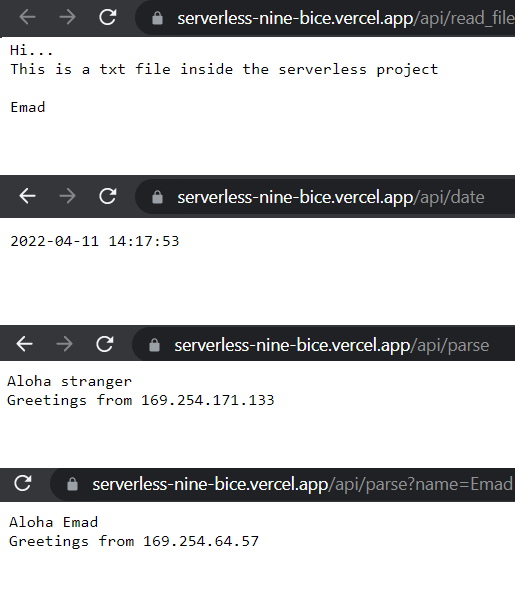

# Serverless

**Author:** Emad Almajdalawi

**Date:** 7/4/2022

**Application Vesrsion:** 0.1.0

**Python Verstion:** 3.9.5

**poetry Vesrsion:** 1.1.13

**pytest verstion:**  5.2

## Overview:
This is an aplication that creats web pages using python serverless functions.

You can visit the website pages by the following:

- https://serverless-nine-bice.vercel.app/api/date 
- https://serverless-nine-bice.vercel.app/api/read_file
- https://serverless-nine-bice.vercel.app/api/parse

    After this url you can add a parameter `?name=FirstName`, for example:
    https://serverless-nine-bice.vercel.app/api/parse?name=Emad

 

 

### Thunder Client testing

To test the web site in thunder cliente, do the following:

- open VS Code
- install the extention Thunder Client
- open a new tab from thunder cliente
- selexct the method GET
- enter the URL that you want to test without parameters
- under the tab Query enter the parameter and enter its value
- click send to receve the result in the right window
- The reponce status shoud be 200 OK and the responce should mension the name that you put in query string.

